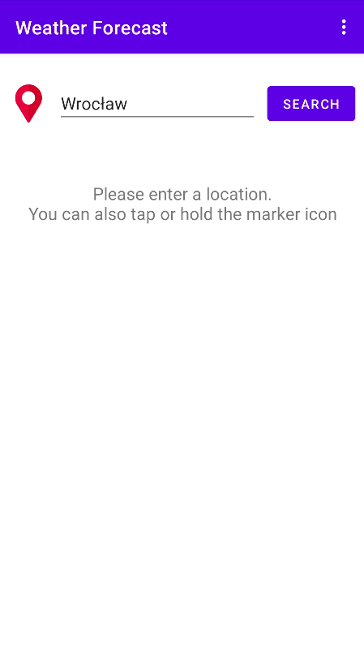
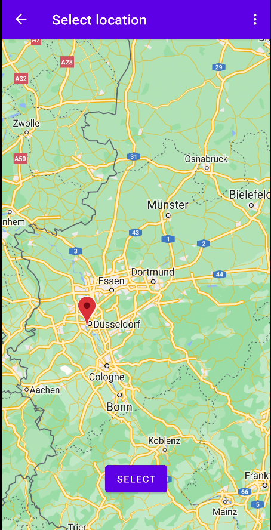
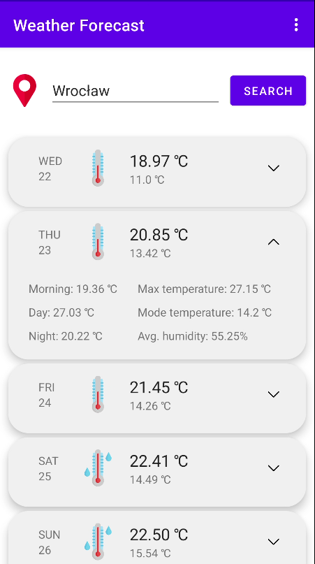

# ABOUT
----
This is a simple Weather Forecasting App created using  https://openweathermap.org/api 
Forecasting only the temperature for the next 5 days 

# HOW TO USE
----

After opening the app you can enter the location manualy or click the marker image for automatic user location obtainment. Alternatively you can hold the marker icon and choose the location on map. 

After map selection the location will be entered into the text field.

Then if you hit the search button a suitable weather forecast will be shown

Each day is shown in a box. The header informations are from left, up to down: Day name and its date, image which represents how high the temperature will be (3 images), average temperature through the entire day, and the minimal day temperature.

If you click the day header a more detailed body will be shown with informations like Morning, Day and Night temperatures alongside with the max temperature expected fot the day, the mode tempreature of the day and average humidity
